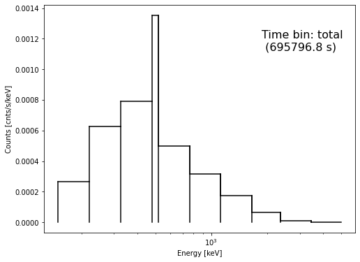
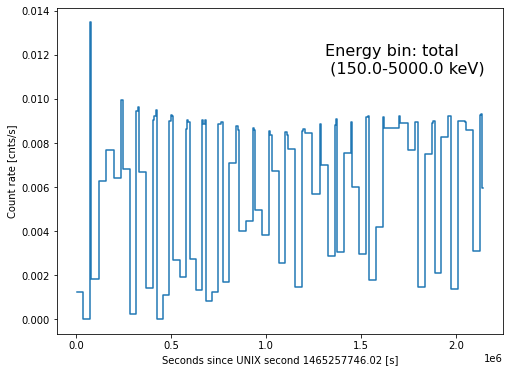
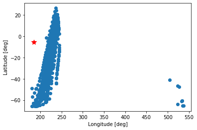
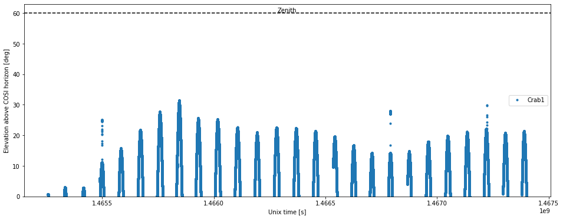

# Reproduce the COSIpy Crab Analysis with Continuum Response


```python
# Imports:
from COSIpy import *
import response
from fit import fit
```

## Main analysis object:


```python
# Load source dataset and define main analysis object:
data_dir = "/zfs/astrohe/Software/COSI/COSIpy/Crab_data"
filename1 = "Crab_data_33km_9dets.tra.gz"
analysis1 = COSIpy(data_dir,filename1)
analysis1.read_COSI_DataSet()
```

#### Defining the 'COSIpy' instance also initiates the 'dataset' object (i.e. the 'dataset' subclass).
#### The data (i.e. 'dataset.data') is then defined by the 'read_COSI_DataSet' function of the COSIpy class.

## Time Binning:


```python
# Define time bins:
Delta_T = 7200 #seconds
analysis1.dataset.time_binning_tags(time_bin_size=Delta_T)
```

#### The 'time_binning_tags' is a function of the 'dataset' subclass and it makes a property called 'times'. 
#### The 'times' property consist of several quantities.
#### Below is an example of how the total time is calculated from the non-zero time bins using the 'times' property.


```python
# First, find number of tagged events in each time bin:
analysis1.dataset.times.n_ph_t
```


    array([ 860,    0,    0,    0,    0,    0,    0,    0,    0,   17, 9365,
           1259,    0,    0,    0,    0,    0,    0,    0,    0,    0, 4351,
           5349,    0,    0,    0,    0,    0,    0,    0,    0,    0, 4462,
           6912, 4750,    0,    0,    0,    0,    0,    0,    0,    0,  159,
           6569, 6692, 4645,    0,    0,    0,    0,    0,    0,    0,    0,
            976, 6295, 6415, 6599,   12,    0,    0,    0,    0,    0,    0,
              0,  773, 6265, 6447, 6428, 1885,    0,    0,    0,    0,    0,
              0,    0, 1346, 6007, 6298, 6227, 1893,    0,    0,    0,    0,
              0,    0,    0,  922, 6304, 6172, 6304,  583,    0,    0,    0,
              0,    0,    0,    0,  868, 6171, 6171, 6236, 1178,    0,    0,
              0,    0,    0,    0,    0,    0, 4935, 6110, 5958, 2781,    0,
              0,    0,    0,    0,    0,    0,    0, 3089, 6024, 5971, 3460,
              0,    0,    0,    0,    0,    0,    0,    0, 2665, 5952, 5805,
           4678,    0,    0,    0,    0,    0,    0,    0,    0, 1788, 5900,
           5816, 5360,    0,    0,    0,    0,    0,    0,    0,    0, 1016,
           5936, 6000, 5883,    0,    0,    0,    0,    0,    0,    0,    0,
              0, 3939, 6154, 4883,    0,    0,    0,    0,    0,    0,    0,
              0, 2006, 6130, 6328, 2115,    0,    0,    0,    0,    0,    0,
              0,    0, 5248, 6224, 4167,    0,    0,    0,    0,    0,    0,
              0,    0, 2059, 6378, 6406, 1242,    0,    0,    0,    0,    0,
              0,    0,    0, 2915, 6376, 6031,    0,    0,    0,    0,    0,
              0,    0,    0,    0, 6030, 6399, 6208,    0,    0,    0,    0,
              0,    0,    0,    0,    0, 5354, 6224, 6223, 1034,    0,    0,
              0,    0,    0,    0,    0,    0, 5226, 6179, 6249, 1457,    0,
              0,    0,    0,    0,    0,    0,    0, 5739, 6424, 6418,  973,
              0,    0,    0,    0,    0,    0,    0,    0, 6244, 6236, 5969,
              0,    0,    0,    0,    0,    0,    0,    0, 2145, 6432, 6465,
           4140])


```python
# Next, only use bins that are non-zero.
# Note that the output corresponds to the indices from the last array.
analysis1.dataset.times.n_ph_dx
```


    array([  0,   9,  10,  11,  21,  22,  32,  33,  34,  43,  44,  45,  46,
            55,  56,  57,  58,  59,  67,  68,  69,  70,  71,  79,  80,  81,
            82,  83,  91,  92,  93,  94,  95, 103, 104, 105, 106, 107, 116,
           117, 118, 119, 128, 129, 130, 131, 140, 141, 142, 143, 152, 153,
           154, 155, 164, 165, 166, 167, 177, 178, 179, 188, 189, 190, 191,
           200, 201, 202, 211, 212, 213, 214, 223, 224, 225, 235, 236, 237,
           247, 248, 249, 250, 259, 260, 261, 262, 271, 272, 273, 274, 283,
           284, 285, 294, 295, 296, 297])


```python
# Print the number of non-zero time bins:
analysis1.dataset.times.n_ph
```


    97


```python
# Finally, get the total time: 
analysis1.dataset.times.total_time
```


    695796.7616381645


## Energy binning:


```python
# Definition of energy bins (exactly as response right now):
energy_bin_edges=np.array([150,  220,  325,  480,  520,  765, 1120, 1650, 2350, 3450, 5000])
```


```python
# Define energy and pixel binning:
pixel_size = 6. #degrees
analysis1.dataset.init_binning(energy_bin_edges=energy_bin_edges,pixel_size=pixel_size)
```

## Bin the data set:


```python
# Bin data:
analysis1.dataset.get_binned_data()
```


    Loop over time bins::   0%|          | 0/298 [00:00<?, ?it/s]


      0%|          | 0/1145 [00:00<?, ?it/s]


      0%|          | 0/1145 [00:00<?, ?it/s]


      0%|          | 0/1145 [00:00<?, ?it/s]


      0%|          | 0/1145 [00:00<?, ?it/s]


      0%|          | 0/1145 [00:00<?, ?it/s]


      0%|          | 0/1145 [00:00<?, ?it/s]


      0%|          | 0/1145 [00:00<?, ?it/s]


      0%|          | 0/1145 [00:00<?, ?it/s]


      0%|          | 0/1145 [00:00<?, ?it/s]


      0%|          | 0/1145 [00:00<?, ?it/s]


      0%|          | 0/1145 [00:00<?, ?it/s]


      0%|          | 0/1145 [00:00<?, ?it/s]


      0%|          | 0/1145 [00:00<?, ?it/s]


      0%|          | 0/1145 [00:00<?, ?it/s]


      0%|          | 0/1145 [00:00<?, ?it/s]


      0%|          | 0/1145 [00:00<?, ?it/s]


      0%|          | 0/1145 [00:00<?, ?it/s]


      0%|          | 0/1145 [00:00<?, ?it/s]


      0%|          | 0/1145 [00:00<?, ?it/s]


      0%|          | 0/1145 [00:00<?, ?it/s]


      0%|          | 0/1145 [00:00<?, ?it/s]


      0%|          | 0/1145 [00:00<?, ?it/s]


      0%|          | 0/1145 [00:00<?, ?it/s]


      0%|          | 0/1145 [00:00<?, ?it/s]


      0%|          | 0/1145 [00:00<?, ?it/s]


      0%|          | 0/1145 [00:00<?, ?it/s]


      0%|          | 0/1145 [00:00<?, ?it/s]


      0%|          | 0/1145 [00:00<?, ?it/s]


      0%|          | 0/1145 [00:00<?, ?it/s]


      0%|          | 0/1145 [00:00<?, ?it/s]


      0%|          | 0/1145 [00:00<?, ?it/s]


      0%|          | 0/1145 [00:00<?, ?it/s]


      0%|          | 0/1145 [00:00<?, ?it/s]


      0%|          | 0/1145 [00:00<?, ?it/s]


      0%|          | 0/1145 [00:00<?, ?it/s]


      0%|          | 0/1145 [00:00<?, ?it/s]


      0%|          | 0/1145 [00:00<?, ?it/s]


      0%|          | 0/1145 [00:00<?, ?it/s]


      0%|          | 0/1145 [00:00<?, ?it/s]


      0%|          | 0/1145 [00:00<?, ?it/s]


      0%|          | 0/1145 [00:00<?, ?it/s]


      0%|          | 0/1145 [00:00<?, ?it/s]


      0%|          | 0/1145 [00:00<?, ?it/s]


      0%|          | 0/1145 [00:00<?, ?it/s]


      0%|          | 0/1145 [00:00<?, ?it/s]


      0%|          | 0/1145 [00:00<?, ?it/s]


      0%|          | 0/1145 [00:00<?, ?it/s]


      0%|          | 0/1145 [00:00<?, ?it/s]


      0%|          | 0/1145 [00:00<?, ?it/s]


      0%|          | 0/1145 [00:00<?, ?it/s]


      0%|          | 0/1145 [00:00<?, ?it/s]


      0%|          | 0/1145 [00:00<?, ?it/s]


      0%|          | 0/1145 [00:00<?, ?it/s]


      0%|          | 0/1145 [00:00<?, ?it/s]


      0%|          | 0/1145 [00:00<?, ?it/s]


      0%|          | 0/1145 [00:00<?, ?it/s]


      0%|          | 0/1145 [00:00<?, ?it/s]


      0%|          | 0/1145 [00:00<?, ?it/s]


      0%|          | 0/1145 [00:00<?, ?it/s]


      0%|          | 0/1145 [00:00<?, ?it/s]


      0%|          | 0/1145 [00:00<?, ?it/s]


      0%|          | 0/1145 [00:00<?, ?it/s]


      0%|          | 0/1145 [00:00<?, ?it/s]


      0%|          | 0/1145 [00:00<?, ?it/s]


      0%|          | 0/1145 [00:00<?, ?it/s]


      0%|          | 0/1145 [00:00<?, ?it/s]


      0%|          | 0/1145 [00:00<?, ?it/s]


      0%|          | 0/1145 [00:00<?, ?it/s]


      0%|          | 0/1145 [00:00<?, ?it/s]


      0%|          | 0/1145 [00:00<?, ?it/s]


      0%|          | 0/1145 [00:00<?, ?it/s]


      0%|          | 0/1145 [00:00<?, ?it/s]


      0%|          | 0/1145 [00:00<?, ?it/s]


      0%|          | 0/1145 [00:00<?, ?it/s]


      0%|          | 0/1145 [00:00<?, ?it/s]


      0%|          | 0/1145 [00:00<?, ?it/s]


      0%|          | 0/1145 [00:00<?, ?it/s]


      0%|          | 0/1145 [00:00<?, ?it/s]


      0%|          | 0/1145 [00:00<?, ?it/s]


      0%|          | 0/1145 [00:00<?, ?it/s]


      0%|          | 0/1145 [00:00<?, ?it/s]


      0%|          | 0/1145 [00:00<?, ?it/s]


      0%|          | 0/1145 [00:00<?, ?it/s]


      0%|          | 0/1145 [00:00<?, ?it/s]


      0%|          | 0/1145 [00:00<?, ?it/s]


      0%|          | 0/1145 [00:00<?, ?it/s]


      0%|          | 0/1145 [00:00<?, ?it/s]


      0%|          | 0/1145 [00:00<?, ?it/s]


      0%|          | 0/1145 [00:00<?, ?it/s]


      0%|          | 0/1145 [00:00<?, ?it/s]


      0%|          | 0/1145 [00:00<?, ?it/s]


      0%|          | 0/1145 [00:00<?, ?it/s]


      0%|          | 0/1145 [00:00<?, ?it/s]


      0%|          | 0/1145 [00:00<?, ?it/s]


      0%|          | 0/1145 [00:00<?, ?it/s]


      0%|          | 0/1145 [00:00<?, ?it/s]


      0%|          | 0/1145 [00:00<?, ?it/s]


## Plot the binned data:


```python
# counts spectrum:
analysis1.dataset.plot_raw_spectrum()
plt.xscale('log')
```





```python
# light curve:
analysis1.dataset.plot_lightcurve()
```





## Telescope properties (pointing and elevation):


```python
# Define an instance of the Pointint class.
# This gives definition of pointings (balloon stability + Earth rotation)
pointing1 = Pointing(dataset=analysis1.dataset,)
```


```python
# Define Galactic longitude and latitude of the Crab:
l1,b1 = 184.55746, -5.78436
```


```python
# Plot telescope pointings and Crab position:
plt.plot(pointing1.zpoins[:,0]+360,pointing1.zpoins[:,1],'o')
plt.plot(l1,b1,'*r',markersize=10)
plt.xlabel('Longitude [deg]')
plt.ylabel('Latitude [deg]')
```


    Text(0, 0.5, 'Latitude [deg]')





```python
# Plot the elevation.
# The elevation is defined as the edge of the field of view (= horizon) minus the angular distance to the source
analysis1.plot_elevation([l1],[b1],['Crab1'])
```





```python

```
