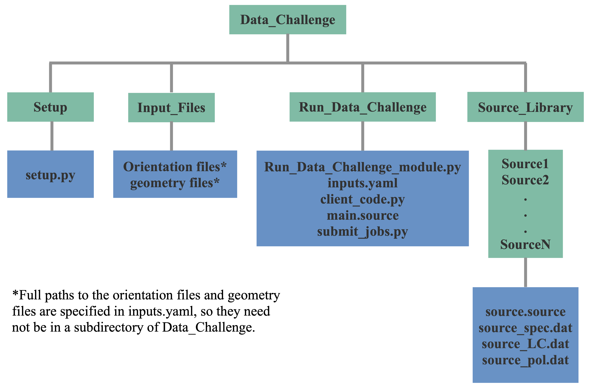

# COSI Data Challenge

## Required Software  
The data challenge module requires the MEGAlib code, available [here](http://megalibtoolkit.com/home.html). Among other things, MEGAlib simulates the emission from any (MeV) gamma-ray source, simulates the instrument response, performs the event reconstruction, and generates simulated data for a given detector design, exposure time, background emission, etc. See the above link for more details regarding the MEGAlib package.   

## Getting Help  
For any help/problems with running the data challenge module please contact me at: ckarwin@clemson.edu. 

## Purpose  
The main purpose of this repository is to simulate the all-sky data that will be observed by COSI. The primary code in this folder is **Run_Data_Challenge_module.py**, which is called with **client_code.py**, with the main input parameters passed via **inputs.yaml**. Additionally, parallel simulations with different time bins can be ran using **run_parellel_sims.py** The modules can be ran directly from the command line, or submitted to a batch system, which allows them to be easily employed for generating multiple/long simulations. 

Below is a simulation input model for the all-sky emission between 500 keV - 1 MeV (based on the AMEGO-X prototype). 

The Galactic diffuse emission is generated using GALPROP, and it includes contributions from inverse-Compton and Bremsstrahlung. The point sources are extrapolated from the 4FGL. 

## Directory Structure  
The schematic below shows the directory structure. Full installation instructions and a quickstart guide are given below. The turquoise boxes represent directories, and the blue boxes represent the contents of the given directory. The main directory (**Data_Challenge**) is provided above. After downloading the main directory, a user will primarily interact with the **Run_Data_Challenge** directory.  

## Available Sources for Simulations  
The simulated sources are passed via the inputs.yaml file. The following sources are available:

**Point Sources:**   
crab  
vela   
cenA  
cygX1  
DataChallenge1: crab, vela, cenA, and cygX1  

## Quickstart Guide   
<pre>
1. Download Data_Challenge directory:
  - download directly or git clone https://github.com/ckarwin/COSI.git
  - Note: This repository does not include the geometery file. 

2. Setup source library with proper paths:
     
     cd Data_Challenge/Setup
     python setup.py
     
3. Everything needed to run the simulations is in Data_Challenge/Run_Data_Challenge </b> 
  - It's advised to add the Run_Data_Challenge directory to your python path.
  - For any new analysis (assuming you added your path), copy the following files to a new analysis directory: client_code.py, inputs.yaml, run_parallel_sims.py, and submit_jobs.py.

4. Specify inputs in inputs.yaml </b>

5. To run the code:  </b>
  - Uncomment the functions inside the client code that you want to run.
  - Running all 4 functions in the client code will generate the output .tra file from mimrec, which will then be passed to COSIpy for analysis.
  - The code can be ran directly from the terminal or submitted to a batch system.
  - To run from the terminal use python client.py.
  - To run parallel jobs in cosima with numerous time bins use python run_parallel_sims.py. 
  - To run a single job in cosima with one time bin use python submit_jobs.py. 

6. If running parallel jobs:
  - You need to specify name, orientation_file, and num_sims in run_parallel_sims.py. 
  - In the client code uncomment all functions except mimrec.
  - Run: python run_parallel_sims.py.  
  - After all the jobs finish, change directory to Main_Output, uncomment just the mimrec function in the client code, then run: python submit_jobs.py.
 
7. Note that some of the code that is used for submitting jobs will be specific to the cluster. Thus it may need to be modified.

8. The client code calls Run_Data_Challenge_module.py </b>
  - Run the help command in the client code for a description of the function inputs.

9. Note: The energy range of the sources in the source library can easily be modified using Source_Library/Make_Sources/make_sources.py. 
  - Change power_low and power_high at top of code. 

</pre>

