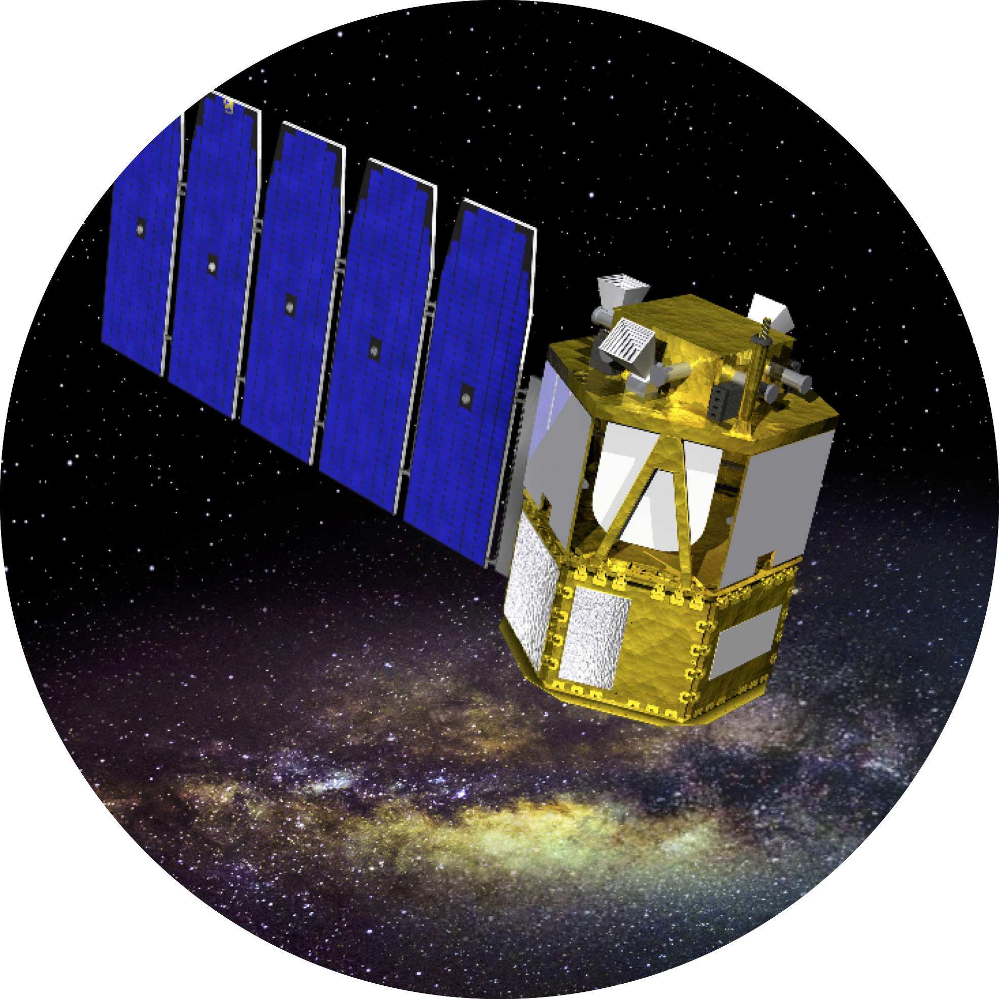

# COSI Data Challenge

## Required Software  
The data challenge module requires the MEGAlib code, available [here](http://megalibtoolkit.com/home.html). Among other things, MEGAlib simulates the emission from any (MeV) gamma-ray source, simulates the instrument response, and generates the simulated data for a given detector design, exposure time, background emission, etc. See the above link for more details regarding the MEGAlib package.   

## Getting Help  
For any help/problems with running the data challenge module please contact me at: ckarwin@clemson.edu. 

## Purpose  
The main purpose of this repository is to simulate the all-sky data that will be observed by COSI. The primary code in this folder is **Run_Data_Challenge_module.py**, which is called with **client_code.py**, with the main input parameters passed via **inputs.yaml**. The modules can be ran directly from the command line, or submitted to a batch system, which allows them to be easily employed for generating multiple/long simulations. 

Below is the full simulation input model for the all-sky emission between 500 keV - 1 MeV. 

The Galactic diffuse emission is generated using GALPROP, and it includes contributions from inverse-Compton and Bremsstrahlung. The point sources are extrapolated from the 4FGL. 

Users can easily choose any combination of sources to simulate. The simulated data can then be analzed using COSIpy, and the results can be compared to the true inputs for validation of the analysis method. 

## Directory Structure  
The schematic below shows the directory structure. Full installation instructions and a quickstart guide are given below. The turquoise boxes represent directories, and the blue boxes represent the contents of the given directory. The main directory (**Data_Challenge**) is provided above. After downloading the main directory, a user will only need to interact with the **Run_Data_Challenge** directory.  

## Available Sources for Simulations  
The simulated sources are passed via the inputs.yaml file. The sources must be from the list below:

**Point Sources:**   
source1  
source2  
crab  
vela   
cenA  

**Galactic Diffuse Sources:**   
 inverse Compton   
 Bremsstrahlung   
 
## Quickstart Guide   
<pre>
1. Download Data_Challenge directory:
  - download directly or git clone https://github.com/ckarwin/COSI.git
  - Note: the geomtery file usually lives in Data_Challenge/Input_Files/Geometry_Files. Howver, it's not currently included in this repository. 

2. Setup library with proper paths:
     
     $cd Data_Challenge/Setup
     $python setup.py
     
3. Everything needed to run the simulations is in Data_Challenge/Run_Data_Challenge </b> 
  - For any new analysis, simply copy the content to the new analysis directory. 
  - The main module is Run_Data_Challenge_module.py. It's advised to keep this in it's original location, and add the module location to your python path.
  
3. Specify inputs in inputs.yaml </b>
  - The locatation of the Data_Challenge directory must be specified. 
  - The full path of the geometry file must be specified.
  - The full path of the orientation file must be specified.
  - The sources to simulute need to be passed in a list of strings, where all names correspond to the list of available sources, as given above. 

4. To run the code: python client_code.py </b>
  - Uncomment the functions inside the client code that you want to run.
  - Running all 4 functions in the client code will generate the output .tra file from mimrec, which will then be passed to COSIpy for analysis. 
  - The code can be ran directly from the terminal or submitted to a batch system. As example script for submitting to a batch system is given in submit_jobs.py.

5. The client code calls Run_Data_Challenge_module.py </b>
  - Run the help commands in the client code for a description of the function inputs.

</pre>

