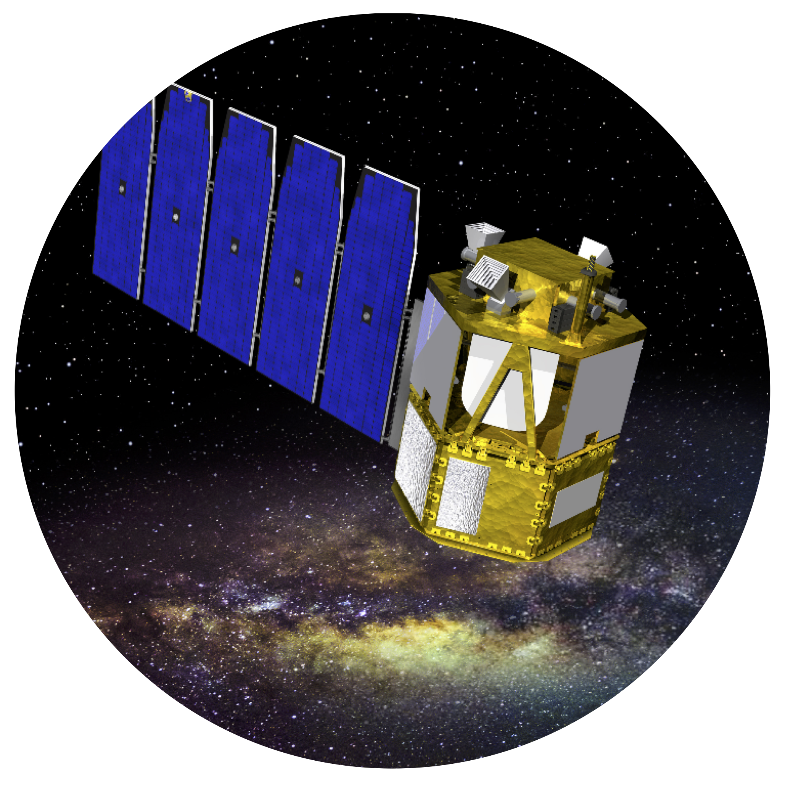
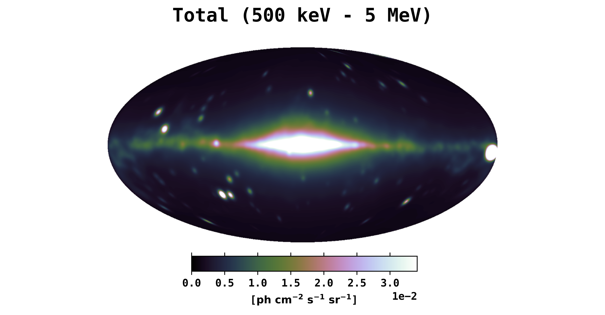
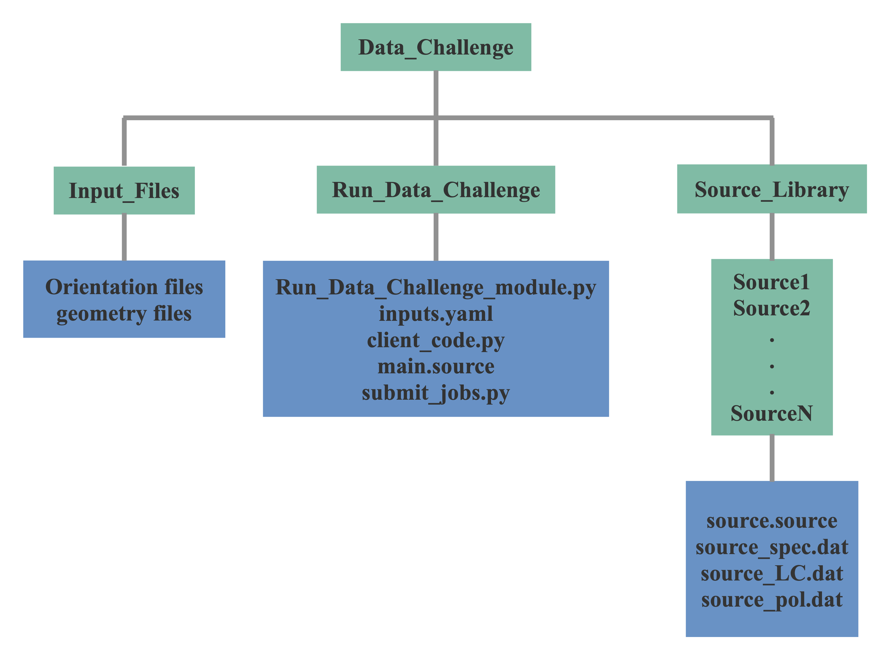

# COSI Data Challenge


<p align="center">

</p>

## Required Software <br />
The data challenge module requires the MEGAlib code, available [here](http://megalibtoolkit.com/home.html). Among other things, MEGAlib simulates the emission from any (MeV) gamma-ray source, simulates the instrument response, and generates the simulated data for a given detector design, exposure time, background emission, etc. See the above link for more details regarding the MEGAlib package.   

## Getting Help <br />
For any help/problems with running the data challenge module please contact me at: ckarwin@clemson.edu. 

## Purpose <br />
The main purpose of this repository is to simulate the all-sky data that will be observed by COSI. The primary code in this folder is **Run_Data_Challenge_module.py**, which is called with **client_code.py**, with the main input parameters passed via **inputs.yaml**. The modules can be ran directly from the command line, or submitted to a batch system, which allows them to be easily employed for generating multiple/long simulations. 

Below is the full simulation input model for the all-sky emission between 500 keV - 1 MeV. 

<p align="center">

</p>

The Galactic diffuse emission is generated using GALPROP, and it includes contributions from inverse-Compton and Bremsstrahlung. The point source are extrapolated from the 4FGL. 

Users can easily choose any combination of sources to simulate. The simulated data can then be analzed using COSIpy, and the results can be compared to the true inputs for validation of the analysis method. 

## Directory Structure <br />
The schematic below shows the directory structure. Full installation instructions and a quick start guide are given below. The turquoise boxes represent directories, and the blue boxes represent the contents of the given directory. A user will primarily interact with the **Run_Data_Challenge** directory.  

<p align="center">

</p>

The AMEGO backgrounds can be found [here](https://github.com/ComPair/Simulation-Data-Files/tree/master/AMEGO_Probe). There are two options, R1 and R5, each organzied with respect to the different components. Currently, R5 is being employed as default. In general the background is calculated over the entire sky. For the main input file the total background can be extracted within ~20 degrees of the source. The background was simulated for 2 hours of exposure, so in the code it's scaled to the observation time that is specified in inputs.yaml. 


```
crab
 ```
 

## Quickstart Guide <br /> 
<pre>
 0. For fastest start (which will take care of step 1 below), directly clone from your working terminal as follows:
  - git clone --depth 1 --filter=blob:none --no-checkout https://github.com/ckarwin/AMEGO_X_Simulations.git
  - cd AMEGO_X_Simulations
  - git checkout master -- TXS_0506+056
  - Then just change the name of the directory as desired.
  
 1. Make the main working directory </b> 
  - Needs to contain the following
    -- client_code.py
    -- Run_MEGAlib_module.py (this can also just be in the the python path instead of the main directory)
    -- Process_MEGAlib_module.py (this can also just be in the the python path instead of the main directory)
    -- ExtractSpectrum.cxx
    -- ExtractLightCurve.cxx
    -- submit_jobs.py (for submitting to batch system)
    -- inputs.yaml
    -- AMEGO_Performance directory (needed for mission="AMEGO")
    -- AMEGO-X_Performance directory (needed for mission="AMEGO-X")

2. Specify inputs in inputs.yaml </b>
  - The input files need to be in a subdirectory of the main working directory called "Inputs".
  - The input files need to have the proper forms, as specified in the MEGAlib documentation. See TXS_0506_056 files in "Inputs" directory for example template.

3. To run the code: python client_code.py </b>
  - Uncomment the functions inside the client code that you want to run.
  - The yaml file can be passed with the terminal command if needed, otherwise it uses the defualt specified in the client code.
  - The code can be ran directly from the terminal or submitted to a batch system using submit_jobs.py (for example).

4. The client code calls Run_MEGAlib_module.py and Process_MEGAlib_module.py </b>
  - Run the help commands in the client code for a description of the function inputs for each module.
  - The module files shouldn't require too much modification.

Below are the original MEGAlib executables for running directly from terminal (mainly for testing, saving configuration files, etc):

1. cosima -s seed name.source | tee terminal_output_cosima.txt
2. revan -g geometry_file -c configuration_file -f name.inc1.id1.sim 
3. mimrec -g geometry_file -f name.inc1.id1.tra
</pre>

